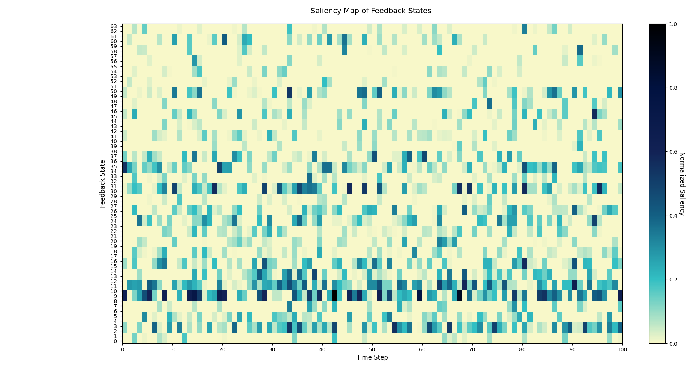

# RL_SaliencyVisualizer
A reproduction code of saliency maps in “Identifying Important Sensory Feedback for Learning Locomotion Skills”
p align="center">
     &nbsp; &nbsp; &nbsp; &nbsp; &nbsp; &nbsp; &nbsp; &nbsp; &nbsp; &nbsp;

